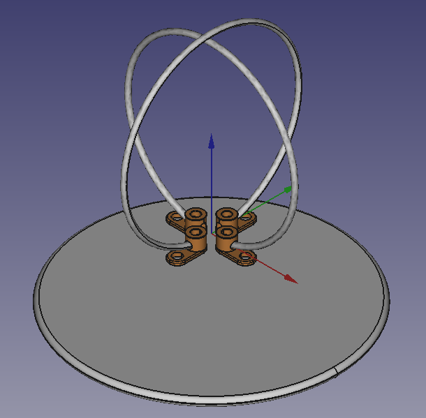

## Eggbeater Antenna

This is a parametric script intended to generate an eggbeater antenna based solely on the frequency.

<em>Caption: The roughed-in eggbeater model showing aerials and ground plane</em>

<em>Image Credit: <a href="http://issyroo.org/">Aaron Harper</a>, <a href="http://mach30.org/">Mach 30</a></em>

## References
* [Eggbeater Design Reference Doc](http://on6wg.pagesperso-orange.fr/Doc/Antenne%20Eggbeater-Engl-Part1-Full.pdf)
* [Mach 30 Ground Sphere Calculation Spreadsheet](https://opendesignengine.net/dmsf_files/271)
* [Discussion on OpenDesignEngine.net About This Project](https://opendesignengine.net/boards/39/topics/789)

## Credit For Help or Inspiration
* [Club Cyberia](http://www.clubcyberia.org/)
* [Mach 30](http://mach30.org/)
* [Issyroo Farms](http://issyroo.org/)
* [Hamspot](http://hamspot.com/)
