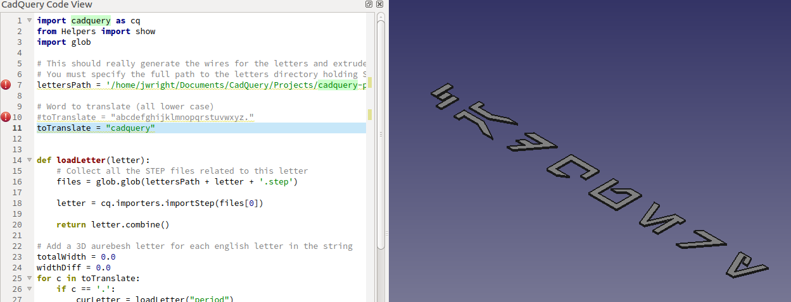

## English to 3D Aurebesh Translator

This script takes a word or name in English and translates it to a 3D version of the [Star Wars](https://en.wikipedia.org/wiki/Star_Wars) alphabet [Auerbesh](https://en.wikipedia.org/wiki/Languages_in_Star_Wars) (A.K.A. Aurekbesh). This script currently relies on previously created STEP files for the letters. A much better (and more proper) way to do this in CadQuery would be to import the SVG chraracter files directly, and then dynamically scale and extrude them. At this time though, CadQuery does not have the ability to import SVGs.

This script uses the simplified Aurebesh alphabet, but could also be expanded to include combined characters from the extended alphabet including 'Ch'.

Image Source: [Wikia](http://starwars.wikia.com/wiki/Aurebesh)
