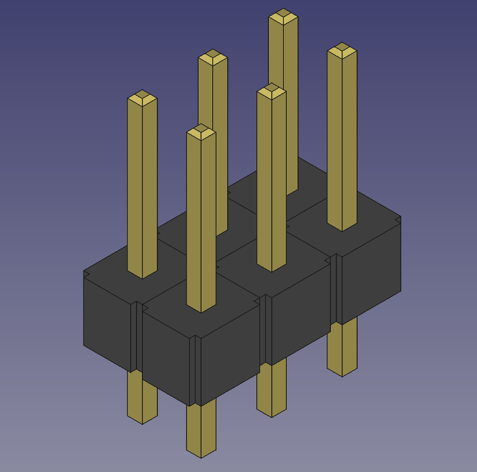

## Header Pin Generator

This script generates male header pins that are commonly used with microcontrollers like the Arduino. Change the `pin_spacing` variable to control how far apart the pins are. A common spacing is 0.1" or 2.54 mm. The `rows` and `columns` variables can be used to create an header array of any size. If running this script from within FreeCAD, the resulting objects that are displayed can be selected and saved or exported and used in an assembly.

